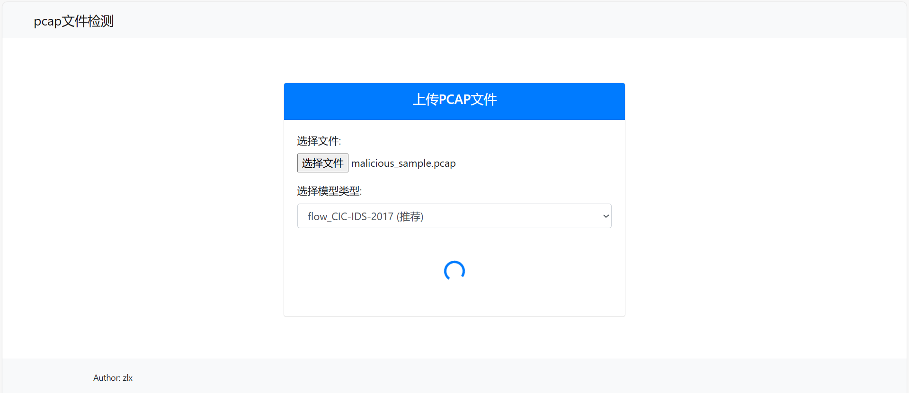
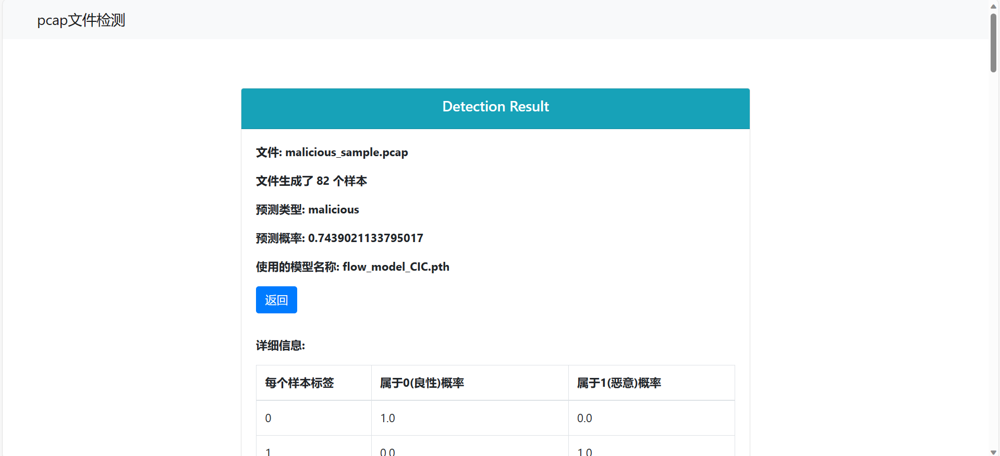
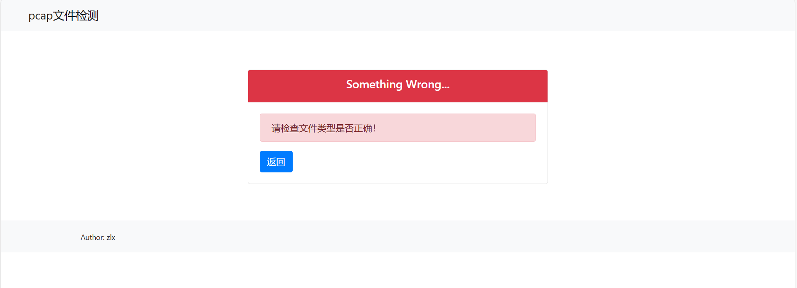

## 基于pytorch的web恶意流量检测平台

利用深度学习进行恶意流量的检测与分类

实现pcap文件的web界面检测，难点在于特征提取，即pcap文件转换为有效的csv文件，现有的公开广泛使用的数据集多是csv格式，是用工具等提取pcap文件特征为csv，难以直接集成在该项目

目前支持用python写的基于包、流、会话的特征提取（具体以及参考代码在后面），但是只有基于流的有较明显的区分能力（其他方式不能说完全无效，可能依赖于数据集和模型）

web模块使用fask+bootstrap+jinja2

使用pytorch，模型对pcap包的检测只实现二分类，但对于流量检测和分类算法还在继续更新...

简单地说，该项目只是一个在线检测pcap文件**用于学习的demo**，尤其需要在pcap预测模型上提高准确率和预测水平

`没有gpu，所有算法都是先在cpu上跑通，需要再去部署云上的，所以模型训练什么的有些代码可能没有.to(device)，，没有改到的地方麻烦自己改一下`

>  如果有大佬能提提意见，比如对pcap文件很有效的python特征提取方式，将感激不尽！以及有其他问题可以联系：`2763445059@qq.com`

### working on version
v3.0.2，v1.2.1

#### 目录

```cmd
/alg # 流量检测算法（独立，不是给web提供的，也不是仅针对pcap的）
       /dataset (手动创建)
       		/UNSW-NB15 (手动创建)
       		/CSE-CIC-IDS2018 (手动创建)
       /alg.../data_script.py
       /alg.../train.py
/data (手动创建)# 用于web预测模型的数据与数据集
       /csv (手动创建)
       /pcap (手动创建)
       /featured_csv (手动创建)
/model (手动创建)# 存放训练好的模型（用于web，暂时只用CNN做了测试）
/extractor # 提取特征工具类
/test # 测试
/utils
	/data # 数据预处理，以及dataset类，获取dataloader类等
/web # web应用相关
       /upload # pcap文件上传路径（手动创建）

tmp.py # pcap预测模型功能测试
model.py # pcap预测模型
model_operate.py # pcap预测模型训练、测试、预测工具类
usemodel.py # pcap预测模型预测pcap文件
extract.py # 提取特征
train.py # pcap预测模型训练，测试
main.py # 运行web服务器

# 注意
# 如果觉得web模块冗余，可以直接去掉main.py和web/文件夹，不会影响其他功能
# 如果只对三种特征提取感兴趣，可以只保留exactor/文件夹，然后调用封装好的类
# 如果只对深度学习算法感兴趣，可以只保留alg/文件夹
# 如果只想用基于web对pcap文件的检测, 可以删去alg/
```

#### 环境

python 3.9（主要和torch，numpy等版本适配即可）

requirements.txt

建议不要直接pip -r，先搭建pytorch环境，其他包如flask手动装下，没有多少，可以直接跑tmp.py所有函数来测试环境

#### 运行

##### pcap预测模型

```cmd
# web程序
python main.py
# 训练，测试（用于web的模型）
python train.py
# 使用模型预测pcap,(不使用web情况下，使用pcap预测模型)
python usemodel.py
# 功能测试
python tmp.py
# 提取特征（pcap转csv）
python extract.py
```

##### alg/训练

```cmd
# data_script.py 对原csv数据的预处理脚本，可以用于参考数据处理
# train.py 训练，测试
python -m alg.graphsage.data_script
python -m alg.graphsage.train --dataset=UNSW-NB15 --binary=1

python -m alg.resnet.data_script
python -m alg.resnet.train --dataset=UNSW-NB15 --binary=1
```

##### 数据集
项目中没有提供数据（太大），

这里用网盘提供原始数据，中间数据，模型等可以用于测试跑通代码的数据，下载解压缩后放入对应文件夹中

trafficdet(data).zip 可以用于跑通所有模块和功能的测试数据

```
链接：https://pan.baidu.com/s/1YQaWSofxRm8z_ELTQSNK8Q 
提取码：oidy
```


#### 特征处理与模型

数据集：

`github.com/iotsecty/malicious_traffic_detection_platform`数据集（仅csv）

ICI-IDS-2017（仅pcap）

##### 特征提取

**基于包（原项目）**

pcap转csv

csv提取特征得到csv （10个特征）---已经弃用

代码参考tmp.py

参考`github.com/iotsecty/malicious_traffic_detection_platform`

**基于流**

pcap提取流特征得到csv（72个特征）

代码参考tmp.py

参考`github.com/jiangph1001/flow-feature`

##### 模型

输入特征数维度，输出[b，2]（二分类），改模型时建议适配，否则需要重写dataset以及dataloader

```cmd
flow_model_CIC.pth #基于流特征,ICI-IDS-2017部分数据集
pkg_model.pth # 基于包特征,原始数据集
pkg_model_CIC.pth #基于包特征,ICI-IDS-2017部分数据集
# 依此类推
```


#### 怎么改pcap预测模型相关

##### 改模型

直接修改model.Net或者重新定义（重新定义需要修改usemodel.py或者train.py的实例化）

##### 改多分类

需要改model.py和utils.data_utils中的dataset和dataloader，然后修改model_operate.py中的损失函数，优化器

##### 改计算文件类别算法

若干样本的类别和概率 -> 整个文件的类别和概率，这部分计算地可能不太科学，可能需要改算法（）

就是改这个：model_operate.ModelOperation().pcap_predict

#### 怎么改alg/ 目录下的算法

算法基本上是单独的，直接拿出来改


#### web运行截图









## trafficdet_v2.0更新说明

2.x版本主要提供web支持，前端是同学写的

## trafficdet_v1.0更新说明

1.x版本没有臃肿的web模块，也未提供web后端接口，只有数据处理，模型训练等功能

## trafficdet_v1.1更新说明

改了若干bug

更改了模型，添加了卷积神经网络(仅支持10或72维度的输入)，支持两种特征提取方式

修改优化了样本结果集成文件结果的算法，改为取概率的平权平均值

完全抛弃了项目`github.com/iotsecty/malicious_traffic_detection_platform`中提供的csv数据集,只使用CIC-IDS-2017的pcap数据集


## trafficdet_v1.1.1更新说明

添加了UNSW-NB15数据集(已经提取好特征的csv文件)，以及预处理代码utils/data/unsw.py

CNN模型添加支持UNSW-NB15的43维度输入, 训练一轮就获得了99%的准确率，说明问题出在特征提取步骤(已移除，分类不同训练方式)


## trafficdet_v1.2更新说明
基于流的特征提取的72个特征，丢弃了ip和端口
```
['fiat_mean', 'fiat_min', 'fiat_max', 'fiat_std', 'biat_mean',
       'biat_min', 'biat_max', 'biat_std', 'diat_mean', 'diat_min', 'diat_max',
       'diat_std', 'duration', 'fwin_total', 'fwin_mean', 'fwin_min',
       'fwin_max', 'fwin_std', 'bwin_total', 'bwin_mean', 'bwin_min',
       'bwin_max', 'bwin_std', 'dwin_total', 'dwin_mean', 'dwin_min',
       'dwin_max', 'dwin_std', 'fpnum', 'bpnum', 'dpnum', 'bfpnum_rate',
       'fpnum_s', 'bpnum_s', 'dpnum_s', 'fpl_total', 'fpl_mean', 'fpl_min',
       'fpl_max', 'fpl_std', 'bpl_total', 'bpl_mean', 'bpl_min', 'bpl_max',
       'bpl_std', 'dpl_total', 'dpl_mean', 'dpl_min', 'dpl_max', 'dpl_std',
       'bfpl_rate', 'fpl_s', 'bpl_s', 'dpl_s', 'fin_cnt', 'syn_cnt', 'rst_cnt',
       'pst_cnt', 'ack_cnt', 'urg_cnt', 'cwe_cnt', 'ece_cnt', 'fwd_pst_cnt',
       'fwd_urg_cnt', 'bwd_pst_cnt', 'bwd_urg_cnt', 'fp_hdr_len', 'bp_hdr_len',
       'dp_hdr_len', 'f_ht_len', 'b_ht_len', 'd_ht_len']
```
1）彻底抛弃了原有的包特征提取方式的10种特征，自定义包提取方式，如下特征23维度
```
['layerInfo', 'len', 'protocol', 'tcp_seq_number', 'tcp_ack_number',
       'tcp_window_size', 'tcp_flags', 'tcp_header_length', 'tcp_checksum',
       'tcp_urgent_pointer', 'udp_length', 'udp_checksum', 'icmp_type',
       'icmp_code', 'icmp_checksum', 'icmp_id', 'icmp_seq', 'icmp_payload',
       'src', 'dst', 'RelativeSeconds', 'tcp_pay_load_action',
       'udp_pay_load_action']
```
基于包的特征提取主要是
标志位，比如syn，ack；
字段，比如seq_num，checksum，icmptype，对该列标准化，或类别编码
内容，比如tcp_payload，udp_payload，提取了协议关键字，连接成表示包的协议层次的字符串，然后类别编码
时间，计算相对第一个包的相对时间
ip端口，组合筛选，类别编码

并优化了文件目录，exactor/ 目录下是各个特征提取器

2）添加了基于会话的特征提取方式，得到了27-4=23个特征输出，丢弃了ip和端口
参考`github.com/Dan-Rdd/Feature-Extraction`
```
["src_ip", "dst_ip", "sport", "dport"]
['type', 'Avg_syn_flag', 'Avg_urg_flag', 'Avg_fin_flag', 'Avg_ack_flag',
       'Avg_psh_flag', 'Avg_rst_flag', 'Duration_window_flow',
       'Avg_delta_time', 'Min_delta_time', 'Max_delta_time',
       'StDev_delta_time', 'Avg_pkts_lenght', 'Min_pkts_lenght',
       'Max_pkts_lenght', 'Total_pkts_Length', 'StDev_pkts_lenght',
       'Avg_small_payload_pkt', 'Avg_payload', 'Min_payload', 'Max_payload',
       'StDev_payload', 'Num Packets']
['label']
```
3）CNN模型支持23维度, 以支持新的基于包的和基于会话的特征提取方式
4）优化了计算文件分类概率的算法

### 实验结果
实验数据：从CIC-IDS 2017数据集上截取了恶意和良性各30万个数据包的pcap文件
#### 基于包的特征提取
训练效果Test set: Average loss: 0.6894, Accuracy: 61135/120000 (51%)
预测的计算概率都基本在50概率左右，区分性差
原因分析：即便已经对包做了一定语义提取（比如提取协议关键字，类别编码），但是不够


#### 基于流的特征提取
训练效果Test set: Average loss: 0.3810, Accuracy: 303/346 (88%)
预测显著偏向良性，但是有很好的区分性
恶意样本检测属于良性的计算概率结果75-80%，而良性样本检测属于良性的计算概率结果大多在90%以上，设置如0.85的阈值下可以很好区分


#### 基于会话的特征提取
训练效果Test set: Average loss: 0.5840, Accuracy: 1215/1669 (73%)
预测显著偏向良性，区分性差，良性样本和恶意样本的计算概率大概在70-75%之间，难以区分
原因分析：对训练集要求高，否则提取不出多少很有意义的会话，对预测样本要求高，要求会话长时间保留，否则一次会话相当于一个流，并且特征还没有那么细粒度


#### 特征提取说明
现有的一些流量以及入侵检测数据集大多都是使用现有工具或其他编程语言来实现特征提取（pcap to csv）的

虽然可以考虑融合包、流、会话的特征提取方式，但是暂时不考虑，工具提取特征也暂时不考虑，难以直接集成在该项目中，或者需要手动选特征


## trafficdet_v3.0 更新说明
在v1.2的基础上添加了自己实现的web界面

移除了对pcap文件预测无帮助的UNSW-NB15数据集的处理，训练和预测代码

移除了test/目录

新增了文件夹alg/，该目录下实现测试一些流量检测分类算法，不会局限于pcap，而是直接对公开数据集的csv文件，

并且该文件夹不使用该web项目实现的一些dataset，dataloader，train_test之类的接口，保持独立性

v1.x版本可能会继续探索python提取pcap特征为csv文件

## trafficdet_v3.0.1更新说明

数据集UNSW-NB15的原始csv文件之一：UNSW-NB15_1.csv

新增了alg/算法graphsage, resnet以及数据预处理脚本, 使用UNSW-NB15的csv数据集, 实现二分类和多分类

## trafficdet_v3.0.2更新说明

数据集CSE-CIC-IDS2018的原始csv文件一部分：
02-14-2018.csv，02-15-2018.csv，02-16-2018.csv，02-21-2018.csv，02-22-2018.csv，02-23-2018.csv，02-28-2018.csv，03-02-2018.csv

新增数据预处理脚本，以及算法graphsage, resnet支持该数据集