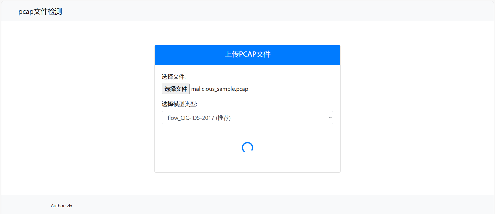
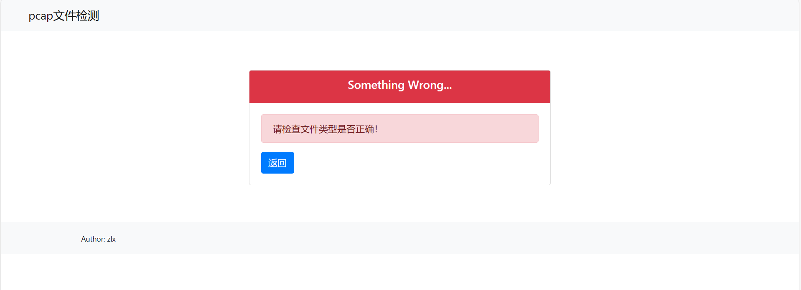

## 基于pytorch的web恶意流量检测平台

利用深度学习进行恶意流量的检测与分类

简单地说，该项目只是一个在线检测pcap文件**用于学习的demo**，以及用于学习加密流量特征提取、恶意流量检测相关算法

**背景**，现有工作大多是基于已经提取好特征的csv文件，或者用工具以及自行设置的特征提取代码（效率更高的c/c++等）来做高效的IDS，基于python且很有效的特征提取比较少，因此难以做一个有效的，并不怎么需要实时性的特征提取方法，以实现对pcap文件的离线检测

**写在前面**，本项目是借助课程设计的机会，对于从pcap中提取特征到训练，到预测，以及深度学习算法的一次探索与尝试，

- 对于特征提取，参考修改并实验了4种方法，并最后提出了scts_extractor：基于scapy和tshark融合统计特征与TLS，DNS的特征提取
       最终3.x特征提取器只保留了区分度较强的：1.基于scapy的流统计特征提取，2.对前者升级的scts_exactor（慢）
       实际上这里提出的scts_extractor也并不很好用，同一模型和开源数据集提取特征的效果差距还是很大
- 对于算法，尝试了CNN, LSTM, 基于CNN的ResNet, 图神经网络算法graphsage，
       在同一特征提取下经比较效果：
              CNN和ResNet效果差不多，但是后者训练更慢
              LSTM略差
              graphsage更差（可能是ip随机化构建图的过程有问题）
       所以最终web端选择了CNN
- 数据集，使用CIC-IDS-2017原始pcap数据集的Monday和Tuesday，

## working on version

v3.0.4，v1.4.1

- v1.x，侧重pcap文件提取特征为csv，并使用模型训练并预测pcap文件，以此评估特征提取，无web支持，1.x的代码在v1.x分支

- v2.x，课程设计版本，在v1.x基础上添加web支持，前端，和其他一些内容是其他同学写的，2.x的代码在v2.x分支中（无更新很长时间了）

- v3.x是在v1.x基础上提供了流量检测与分类算法测试目录alg/（独立于其他模块），以及自己写的相对简洁前端，3.x的代码在默认main分支中

>  如果有大佬能提提意见，以及有其他问题可以联系：`2763445059@qq.com`

## 功能

- 从pcap提取特征到csv文件，然后csv文件可能进行进一步处理
- 利用pcap转换为csv的数据集进行模型训练，并能够对pcap文件进行预测
- WEB交互界面

> 实现pcap文件的web界面检测，
>
> 难点在于
>
> 1. 特征提取，即pcap文件转换为有效的csv文件
> 2. 特征提取时样本粒度：包，单向流，双向流，会话？
> 3. 数据集质量（恶意的pcap文件中所提取的若干样本（比如，双向流）不一定都是恶意的）
> tips, 数据集这部分或许可以提取特征后先做个预聚类再打标签


## 目录

```cmd
/alg # 流量检测算法（独立，不是给web提供的，也不是仅针对pcap的）
       /dataset (手动创建)
       		/UNSW-NB15 (手动创建)
       		/CSE-CIC-IDS2018 (手动创建)
       /alg.../data_script.py # 原始数据处理脚本
       /alg.../train.py
/data (手动创建)# 用于web预测模型的数据与数据集
       /csv (手动创建)
       /pcap (手动创建)
       /featured_csv (手动创建)
/model (手动创建)# 存放训练好的模型（用于web，暂时只用CNN做了测试）
/extractor # 提取特征工具类
/test # 测试
/utils
	/data # 数据预处理，以及dataset类，获取dataloader类等
/web # web应用相关
       /upload (手动创建) # pcap文件上传路径

tmp.py # pcap预测模型功能测试
model.py # pcap预测模型
model_operate.py # pcap预测模型训练、测试、预测工具类
usemodel.py # pcap预测模型预测pcap文件
extract.py # 提取特征
train.py # pcap预测模型训练，测试
main.py # 运行web服务器

# 注意！！！
# 如果觉得web模块冗余，可以直接去掉main.py和web/文件夹，不会影响其他功能
# 如果只对三种特征提取感兴趣，可以只保留exactor/文件夹，然后调用封装好的类或方法
# 如果只对深度学习算法感兴趣，可以只保留alg/文件夹
# 如果只想用基于web对pcap文件的检测, 可以删去alg/
```

## 环境

python 3.9（主要和torch，numpy等版本适配即可）

requirements.txt

建议不要直接pip -r，先搭建pytorch环境，其他包如flask，scapy手动装，没有多少

## 运行

#### pcap预测模型

```cmd
# web程序
python main.py
# 训练，测试（用于web的模型）
python train.py
# 使用模型预测pcap,(不使用web情况下，使用pcap预测模型)
python usemodel.py
# 功能测试
python tmp.py
# 提取特征（pcap转csv）
python extract.py
```

#### alg/训练

目前支持算法 resnet, graphsage

```cmd
# data_script.py 对原csv数据的预处理脚本，可以用于参考数据处理
# train.py 训练，测试
python -m alg.graphsage.data_script
python -m alg.graphsage.train --dataset=UNSW-NB15 --binary=1

python -m alg.resnet.data_script
python -m alg.resnet.train --dataset=UNSW-NB15 --binary=1
```

#### 数据集
项目中没有提供数据（太大），

这里用网盘提供原始数据，中间数据，模型等可以用于测试跑通代码的数据，下载解压缩后放入对应文件夹中

**开始**

`trafficdet(data).zip` 提供了可以用于跑通1.x所有模块和功能的测试数据

**快速开始**

实际上，只要有pcap文件的恶意样本和非恶意样本，就能跑通除alg/ 以外的全部功能

`pcap_smaple.zip` 提供了从CIC-IDS-2017中恶意和非恶意pcap文件各自截取30万个数据包，可以用于测试跑通代码

- 如果需要alg/ 模块的数据，可以下载CSE-CIC-IDS2018.zip，UNSW-NB15_1.zip等文件（也可以去官网下载）

```
链接：https://pan.baidu.com/s/1Z4kzuISRaNTnXxxQG40khQ 
提取码：f4hz
```


### 特征提取

特征提取（pcap -> csv）

- scapy基于包的特征提取
- scapy基于流的特征提取
- scapy基于会话的特征提取
- 基于t_shark的加密流特征提取
- scts_exactor加密流特征提取（"scapy基于流的特征提取"升级版）

**v3.0.3以及3.x之后版本，将只提供scts_exactor和scapy基于流的特征提取方法以及训练预测以及web部分，不过在1.x版本中中仍然保留**

**scts_exactor**是利用scapy库和tshark命令行工具结合的特征提取方法，粒度：stream（双向流，也可以视为会话）

scapy库提取一个pcap文件中若干stream的字段与统计特征

tshark（需要tshark环境变量）提取TLS特征和DNS背景信息

**更多信息**

特征提取方式scts_exactor：<a href="readme/scts_extractor.md">scts_exactor</a>

其他特征提取方式，特征提取效果实验以及参考信息：<a href="readme/pcap2csv特征提取.md">特征提取实验以及参考信息</a>


### web模块

v3.x版本：web模块使用fask+bootstrap+jinja2


### DL算法模块

使用pytorch，模型对pcap包的检测只实现二分类，但对于流量检测和分类算法还在继续更新...（不局限于pcap和二分类）

`没有gpu，所有算法都是先在cpu上跑通，需要再去部署云上的，所以模型训练什么的有些代码可能没有.to(device)，，没有改到的地方麻烦自己改一下`


### 怎么改pcap预测模型相关

##### 改模型

直接修改model.Net或者重新定义（重新定义需要修改usemodel.py或者train.py的实例化）

**pcap预测模型**

输入特征数维度，输出[b，2]（二分类），改模型时建议适配，否则需要重写dataset以及dataloader相关类

```cmd
# 模型命名
flow_model_CIC.pth #基于流特征,ICI-IDS-2017部分数据集
pkg_model.pth # 基于包特征,原始数据集
pkg_model_CIC.pth #基于包特征,ICI-IDS-2017部分数据集
# 依此类推
```

##### 改多分类

需要改model.py和utils.data_utils中的dataset和dataloader，然后修改model_operate.py中的损失函数，优化器

##### 改计算文件类别算法

若干样本的类别和概率 -> 整个文件的类别和概率，这部分计算地可能不太科学，可能需要改算法

就是改这个：model_operate.ModelOperation().pcap_predict -> get_result()

##### 怎么改alg/ 目录下的算法

算法是单独的，直接把文件夹拿出来用，改


## web运行截图

v3.x版本






## 其他

更新说明：<a href="readme/更新说明.md">更新说明</a>

